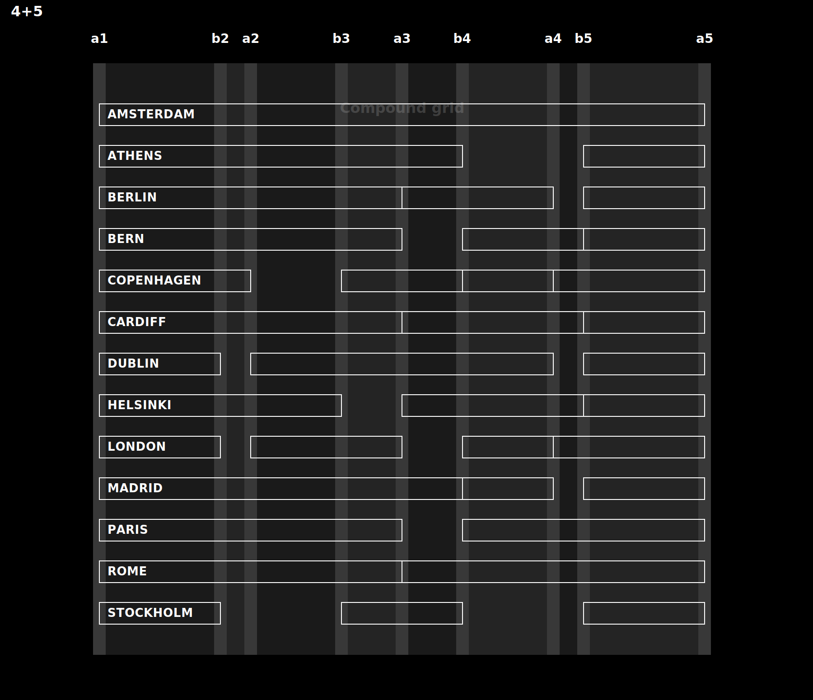
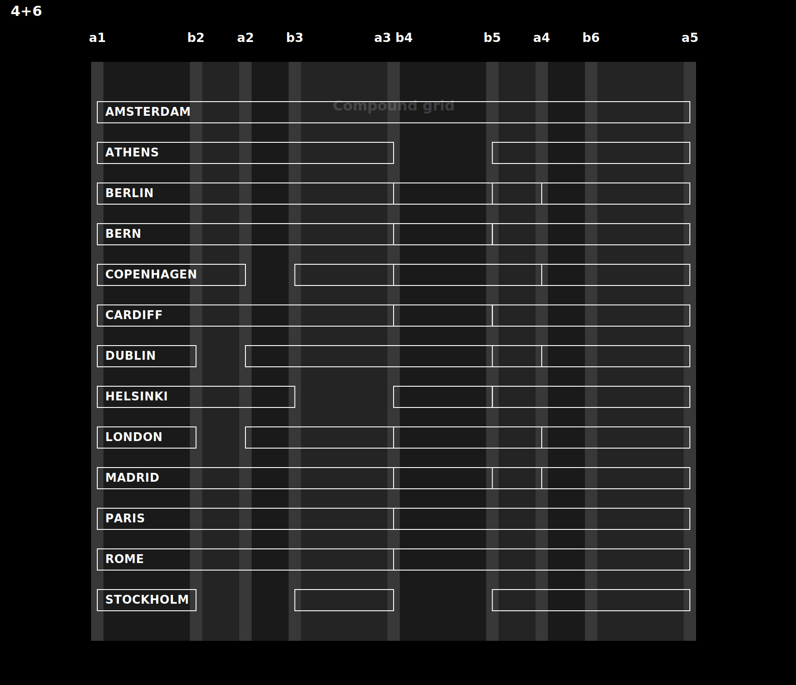
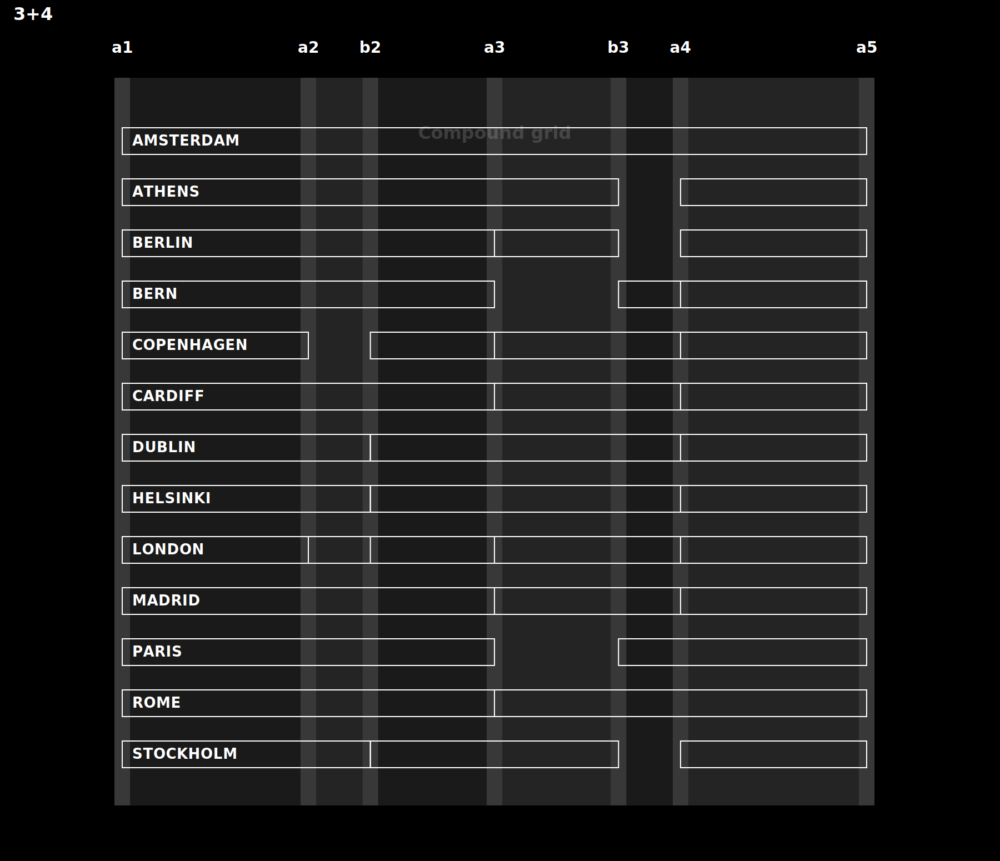

# Layout system diagrams

Corrected compound grid diagrams for the city-based layout system.



```css
--grid-4-5: [a1] 4fr [b2] 1fr [a2] 3fr [b3] 2fr [a3] 2fr [b4] 3fr [a4] 1fr [b5] 4fr [a5];
```



```css
--grid-4-6: [a1] 2fr [b2] 1fr [a2] 1fr [b3] 2fr [a3 b4] 2fr [b5] 1fr [a4] 1fr [b6] 2fr [a5];
```



```css
--grid-3-4: [a1] 3fr [a2] 1fr [b2] 2fr [a3] 2fr [b3] 1fr [a4] 3fr [a5];
```

Regenerate the SVGs with:

```bash
node docs/layout-system/generate-grid-diagrams.js
```
